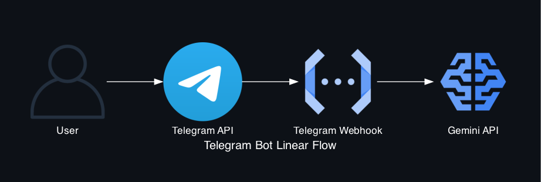

# Simple Telegram Bot with Gemini AI

A lightweight Telegram bot powered by Google Gemini API, following Python best practices with dotenv for secure credential management.

## Features

- 🤖 Telegram bot integration with pyTelegramBotAPI
- 🧠 Google Gemini AI responses with internet search grounding
- 🔒 Secure credential management with python-dotenv
- 📝 Automatic message chunking for long responses
- 🌐 Dual mode: Local polling & Google Cloud Functions webhook
- 👤 Personalized responses with user name recognition

## Quick Start (Local Development)

### 1. Set up environment variables

Create a `.env` file from the template:

```bash
cp .env.example .env
```

Edit `.env` and add your credentials:

```env
# Telegram Bot Configuration
TG_KEY=your_telegram_bot_token_here

# Google Gemini API Configuration
GEMINI_KEY=your_gemini_api_key_here
```

**Get your credentials:**
- **Telegram Bot Token**: Chat with [@BotFather](https://t.me/botfather) on Telegram
- **Gemini API Key**: Get from [Google AI Studio](https://aistudio.google.com/apikey)

### 2. Install dependencies

```bash
pip install -r requirements.txt
```

### 3. Run the bot locally

```bash
./run_local.sh
```

Or manually:
```bash
export FORCE_POLLING=true
python main.py
```

## Customization

Edit the `SYSTEM_PROMPT` in `main.py` to customize the bot's behavior:

```python
SYSTEM_PROMPT = """You are an AI assistant.

Your guidelines:
- If the user's name is provided, acknowledge them personally
- Respond in simple, clear, and concise English - No fluff
- Also translate default response into simple Iban Sarawak language
- Respond in **Telegram HTML syntax**. Use <b> for bold, <i> for italic, and <code> for code."""
```

## How It Works

1. User sends a message to the bot on Telegram
2. Bot receives the message and prepends the user's name for personalization
3. Message is sent to Gemini API with your custom system prompt
4. Gemini processes with Google Search grounding (internet access) and returns a response
5. Response is automatically chunked if over 700 characters
6. Bot sends the response(s) back to the user in HTML format

## Architecture

### System Flow

The bot operates in two modes: **Polling Mode** (local testing) and **Webhook Mode** (cloud deployment).

#### Webhook Mode (Google Cloud Functions)


**Flow:**
1. User sends message via Telegram app
2. Telegram API receives and forwards to GCP webhook
3. Cloud Function processes message and calls Gemini API
4. Gemini API returns AI-generated response
5. Response flows back through the webhook to Telegram API
6. User receives the response

#### Linear Flow Diagram



This simplified view shows the one-way message flow from user to AI response.

### Generate Architecture Diagrams

The project includes a diagram generator using the [Diagrams](https://diagrams.mingrammer.com/) library:

```bash
python generate_diagram.py
```

This creates three visualization variants:
- `telegram_bot_architecture.png` - Top-to-bottom architecture view
- `telegram_bot_architecture_lr.png` - Left-to-right architecture view  
- `telegram_bot_linear.png` - Simplified linear flow

The diagrams feature:
- 🎨 Dark theme matching GitHub's dark mode
- 🏗️ Cloud platform clustering (Google Cloud Platform)
- 🔄 Bidirectional flow visualization
- 🎯 Clear component relationships

## Project Structure

```
.
├── main.py                          # Main bot code with dual mode support
├── generate_diagram.py              # Architecture diagram generator
├── requirements.txt                 # Python dependencies
├── .env                             # Your credentials (gitignored)
├── .env.example                     # Template for credentials
├── run_local.sh                     # Local testing script
├── deploy_cloud.sh                  # Google Cloud Functions deployment
├── ENV_SETUP.md                     # Detailed environment setup guide
├── telegram_bot_architecture.png    # Architecture diagram (top-down)
├── telegram_bot_architecture_lr.png # Architecture diagram (left-right)
└── telegram_bot_linear.png          # Linear flow diagram
```

## Deployment Options

### Google Cloud Functions (Webhook Mode)

Deploy to GCP for serverless, scalable operation:

```bash
./deploy_cloud.sh YOUR_PROJECT_ID REGION
```

Example:
```bash
./deploy_cloud.sh my-telegram-bot asia-southeast1
```

The script will:
- Read credentials from `.env` file
- Deploy to Google Cloud Functions
- Set up the Telegram webhook automatically

**See `deploy_cloud.sh` for detailed deployment options.**

### Other Platforms

For Railway, Heroku, or VPS deployment, set these environment variables:

| Variable | Description |
|----------|-------------|
| `TG_KEY` | Your Telegram bot token |
| `GEMINI_KEY` | Your Google Gemini API key |

## Environment Variables

The bot uses **python-dotenv** for secure credential management:

- **Local**: Automatically loads from `.env` file
- **Cloud**: Deploy script reads from `.env` and sets GCP environment variables
- **Security**: `.env` is gitignored and never committed

See `ENV_SETUP.md` for detailed setup instructions.

## Development

### Running in Polling Mode (Local Testing)

Set `FORCE_POLLING=true` to test locally without webhooks:

```bash
export FORCE_POLLING=true
python main.py
```

### Running in Webhook Mode (GCF)

Automatically detected when deployed to Google Cloud Functions.

### Visualization Tools

Generate or regenerate architecture diagrams:

```bash
python generate_diagram.py
```

**Diagram customization** in `generate_diagram.py`:
- Modify `graph_attr` dict to change colors and layout
- Adjust `nodesep` and `ranksep` for spacing
- Change `bgcolor` for different themes
- Add/remove components to match your architecture

The script uses the `diagrams` library which requires Graphviz:
```bash
# macOS
brew install graphviz

# Ubuntu/Debian
sudo apt-get install graphviz
```

## Message Chunking

Long responses are automatically split into chunks of 700 characters (configurable via `MAX_CHUNK_LIMIT` in `main.py`) to comply with Telegram's limits while maintaining readability.

## Security Best Practices

✅ Uses `.env` file for credentials (gitignored)  
✅ Never commit API keys to version control  
✅ Template file (`.env.example`) shows required format  
✅ Follows python-dotenv standard practices  

## Requirements

### Python Dependencies
- Python 3.12+
- pyTelegramBotAPI
- google-genai
- python-dotenv
- functions-framework (for GCF deployment)
- diagrams (for architecture visualization)

### System Dependencies
- Graphviz (for diagram generation)

## License

This project is open source and available for personal and commercial use.
